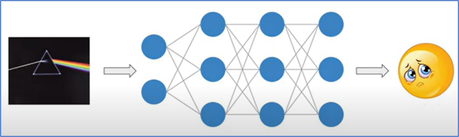

# Music Emotion Detection with Human-Interpretable Mid-Level Features

## 1. Project context
The "Song of Storms" production experience revealed the vital role of human-machine synergy in crafting humane audience experiences. Real-time synchronization of machines' sounds with musicians' dynamic emotions is crucial yet presents challenges with the traditional static rule-based signal processing. 

## 2. Project objective
Excited by AI-powered emotion detection research, I studied an emotion classification algorithm based on a Visual Geometry Group (VGG)-style neural network. By using music's spectrogram representation as input, and training the VGG model to recognize human-interpretable, mid-level perceptual features (e.g., melodiousness, dissonance, and tonal stability, etc.) from the spectrogram, the algorithm can rate emotions by linearly combining the mid-level feature predictions. For instance, the rating of happy emotion=0.42xtonal_stability + 0.37xrhythm_complexity + 0.18xarticulation - 0.46xdissonance - 0.41xmodality - 0.16xrhythm_stability. 

My experimentation with various music has yielded close to 80% classification accuracy.

https://becominghuman.ai/what-is-the-vgg-neural-network-a590caa72643
