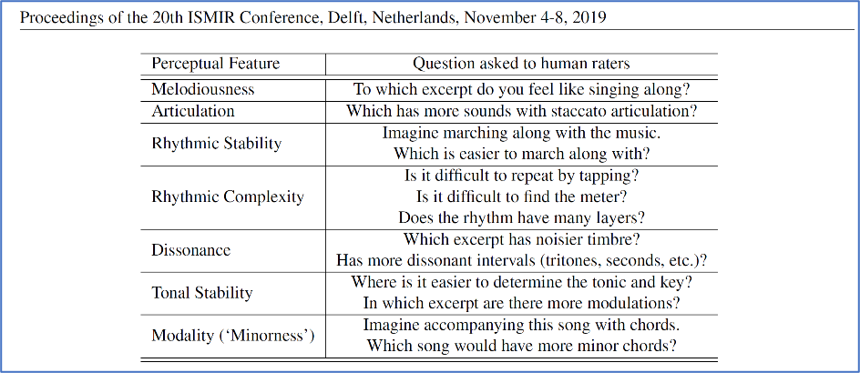

# Music Emotion Detection with Human-Interpretable Mid-Level Features

## 1. Project context
The "Song of Storms" production experience revealed the vital role of __`human-machine synergy`__ in crafting __`humane audience experiences`__. Real-time __`synchronization`__ of __`machines' sounds`__ with musicians' __`dynamic emotions`__ is crucial yet presents challenges with the traditional __`static rule-based signal processing`__. Applying AI to detect emotions in music has become one of the main approaches in academic research. __`AI-based emotion detection`__ typically involves training machine learning models, particularly neural networks, on large datasets of music that have been pre-labeled with various emotional states. The process generally includes these steps:
- __Data Collection__: Compile a diverse dataset of music pieces, each annotated with specific emotional labels like happiness, sadness, anger, etc.
- __Feature Extraction__: Analyze and extract features from the music that are relevant to emotion, such as tempo, pitch, rhythm, harmony, and dynamics.
- __Model Training__: Train a machine learning model, such as a neural network, using this labeled dataset. The model learns to associate specific musical features with corresponding emotions.
- __Validation and Testing__: Test the model on a separate set of data to validate its accuracy in predicting emotional content.
- __Application__: Implement the trained model in emotion detection applications.

## 2. Project objective
Excited by AI-powered emotion detection research, I studied an emotion classification algorithm based on a Visual Geometry Group (VGG)-style neural network. By using music's spectrogram representation as input, and training the VGG model to recognize human-interpretable, mid-level perceptual features (e.g., melodiousness, dissonance, and tonal stability, etc.) from the spectrogram, the algorithm can rate emotions by linearly combining the mid-level feature predictions. For instance, the rating of "happy emotion"=0.42x"tonal_stability" + 0.37x"rhythm_complexity" + 0.18x"articulation" - 0.46x"dissonance" - 0.41x"modality" - 0.16x"rhythm_stability". 

## 3. Project details
This section provides a detailed explanation of the AI model, and a step-by-step guide to applying the model for emotion detection.

This project is based on an AI-powered music emotion recognition research paper--[Towards Explainable Music Emotion Recognition: The Route via Mid-level Features](https://arxiv.org/pdf/1907.03572) by S. Chowdhury et al. The model tries to give a musically meaningful and intuitive explanation for its music emotion predictions. A VGG-style deep neural network has been adopted to classify emotional characteristics of a musical piece together with (and based on) human-interpretable, mid-level perceptual features.

### 3.1 Music data preprocessing

In terms of preprocessing, audio samples are initially transformed into 149-point spectrograms. These are derived from 10-second segments randomly chosen from the original audio. The samples are resampled at a frequency of 22.05 kHz, with each frame comprising 2048 samples and a frame rate set at 31.25 frames per second. Before creating the logarithmic-scaled spectrogram, the audio's amplitude is normalized. This process produces input vectors with dimensions of 313x149, which are then utilized as inputs for the subsequent model architectures.

### 3.2 Mid-level features

Perceptual mid-level features is defined in [A datadriven approach to mid-level perceptual musical feature modeling](https://arxiv.org/pdf/1806.04903.pdf) by A. Aljanaki et al., along with questions that were provided to human raters to help them interpret the concepts. (The ratings were collected in a pairwise comparison scenario.)

### 3.2 VGG-style neural network
VGGNet is invented by Visual Geometry Group (by Oxford University). This architecture is the 1st runner up of ILSVR2014 in the classification task while the winner is GoogLeNet. This tutorial [Introduction to VGGNet](https://becominghuman.ai/what-is-the-vgg-neural-network-a590caa72643) is a good source if you are interested in the detailed VGG architecture.

### 3.3 Emotion detection architecture
The research explored three distinct methods for emotion modeling in audio, each utilizing VGG-style convolutional neural networks (CNNs). The specifics of these architectures are illustrated in the following figure. Across all models, an Adam optimizer with a learning rate set at 0.0005 and a batch size of 8 was employed. Additionally, to mitigate overfitting, early stopping was implemented, set to trigger after 50 epochs without improvement.

### 3.4 Mid-level features
